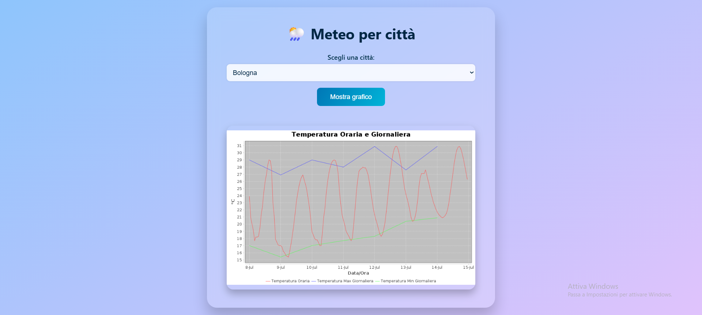

# 🌦️ Meteo App — Spring Boot + Docker

Una web app meteo semplice, elegante e containerizzata, costruita con **Spring Boot** e **WebClient** per interrogare l'API [Open-Meteo](https://open-meteo.com/) e generare dinamicamente un **grafico PNG** con le temperature. L'interfaccia utente è responsive, moderna e completamente stateless.

---

## 📸 Anteprima



---

## 🧠 Descrizione del progetto

- Il backend Spring Boot interroga Open-Meteo tramite `WebClient` passando coordinate geografiche
- Riceve dati orari e giornalieri in JSON e genera un grafico temperatura usando una libreria Java (es. JFreeChart)
- Il grafico viene esposto tramite endpoint REST come immagine PNG
- Il frontend HTML/CSS consente la selezione della città con caricamento dinamico del grafico

---

## 🧰 Stack Tecnologico

| Componente         | Tecnologia                      |
|--------------------|----------------------------------|
| Linguaggio         | Java 17+                         |
| Framework backend  | Spring Boot 3.x                  |
| HTTP client        | Spring `WebClient`               |
| Generazione grafici| JFreeChart / Java2D              |
| Frontend statico   | HTML5, CSS3                      |
| Contenitore        | Docker                           |
| API esterna        | [Open-Meteo](https://open-meteo.com/) |

---

## 📂 Requisiti

- Java 17+
- Maven 3.x
- Docker Engine

---

## 🚦 Guida passo-passo per avviare l’app Meteo su un altro PC

### 1. Scarica il progetto

**Con Git:**
```bash
git clone https://github.com/tuo-utente/meteo-app.git
```
```bash
cd meteo-app
```
**Oppure:**  
Scarica il progetto come ZIP da GitHub, estrailo in una cartella a piacere.

---

### 2. (Facoltativo) Compila il progetto Java

Se vuoi ricostruire il jar:

**Su Windows:**
```bash
mvnw.cmd clean package -DskipTests
```
**Su Mac/Linux:**
```bash
./mvnw clean package -DskipTests
```

---

### 3. Avvia l’applicazione con Docker Compose

Assicurati che **Docker Desktop** sia avviato.

Poi, nella cartella del progetto, esegui:

```bash
docker-compose up --build
```

- Questo comando costruisce l’immagine Docker e avvia il container.
- La porta 8080 del tuo PC sarà collegata all’applicazione.

---

### 4. Apri l’applicazione nel browser

Vai su:
```
http://localhost:8080
```
Vedrai:
- Un menu a tendina con le città (Torino, Milano, ecc)
- Un bottone per “Mostra grafico”
- Un grafico meteo aggiornato in tempo reale 📈

---

## 🛑 Come fermare l’app

Nel terminale dove hai lanciato Docker Compose, premi `CTRL+C`.  
Per rimuovere i container:
```bash
docker-compose down
```

---

## 🔎 File principali del progetto

- [MeteoController.java](src/main/java/com/vale/meteo/controller/MeteoController.java): gestisce le richieste HTTP e restituisce dati/grafici.
- [ExternalApiServiceImpl.java](src/main/java/com/vale/meteo/service/ExternalApiServiceImpl.java): si occupa delle chiamate all’API Open-Meteo.
- [meteo.html](src/main/resources/templates/meteo.html): interfaccia utente web.
- [application.properties](src/main/resources/application.properties): configurazione dell’API e delle impostazioni dell’app.
- [docker-compose.yml](docker-compose.yml): avvio semplificato con Docker Compose.

---

## ℹ️ Problemi comuni

- **Porta 8080 occupata:** chiudi altri programmi che la usano o modifica la porta in `docker-compose.yml`.
- **Permessi Docker/Maven:** su Windows esegui il terminale come amministratore.
- **Errore “jar mancante”:** assicurati che la cartella `target/` contenga il file `.jar` (compila con Maven se serve).

